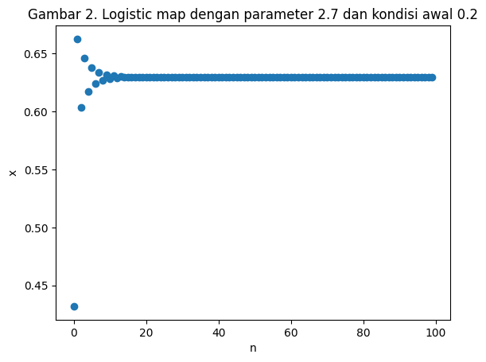

<script type="text/x-mathjax-config">
    MathJax.Hub.Config({
        tex2jax: {
        skipTags: ['script', 'noscript', 'style', 'textarea', 'pre'],
        inlineMath: [['$','$']]
        }
    });
    </script>
      
<script type="text/javascript" async src="https://cdn.mathjax.org/mathjax/latest/MathJax.js?config=TeX-MML-AM_CHTML"> </script>

***

# Sistem Kacau

**Tidak semua sistem dapat diprediksi**

*Posted on January 2024*

***

Persamaan differensial dan persamaan differen digunakan untuk memodelkan pergerakan suatu proses atau sistem. Mulai dari proses fisik hingga proses sosial. Pembuatan produk detergen, pergerakan kendaraan tanpa awak, pergerakan revenue perusahaan, hingga perubahan populasi di suatu wilayah.

Proses-proses ini diajarkan kepada kita saat berkuliah sesuai bidang masing-masing. Mahasiswa teknik kimia akan diajarkan proses pembuatan produk dari bahan-bahan kimia. Mahasiswa ekonometrik mempelajari pemodelan parameter ekonomi. Dan seterusnya.

Kebanyakan, proses yang diajarkan pada strata sarjana adalah proses atau sistem linear. Sistem linear adalah sistem yang propertinya dapat dijelaskan dan diketahui dengan menjumlahkan komponen-komponen pembentuknya.

Sebagai contoh, perhatikan suatu perusahaan hipotetikal dimana model prediksi revenue yang perusahaan dapatkan dalam suatu bulan bergantung pada $20%$ revenue pada bulan sebelumnya ditambah dengan $80%$ penjualan. Perusahaan ini menargetkan penjualan di tahun ini sebesar $500$ buah dengan harga barang $1$ dollar. Jika revenue yang didapatkan pada bulan desember tahun lalu sebesar $5000$ dollar, kita dapat memprediksi revenue untuk $12$ bulan kedepan. sistem ini dapat dimodelkan dengan persamaan

$$R_{n+1} = 0.2 \times R_n + 0.8 \times q \times P$$

dimana $R$ adalah revenue, $q$ adalah jumlah barang yang terjual, $P$ adalah harga barang per unit dan $n$ adalah bulan.

Persamaan ini dapat kita selesaikan secara komputasi


```python
import numpy as np
import matplotlib.pyplot as plt

# revenue
def revenue(R0, q, P, months):
  R_list = []
  month_list = []
  R = R0
  for month in range(months):
    R = 0.2*R + 0.8*q*P
    month_list.append(month)
    R_list.append(R)
  return month_list, R_list
```


```python
months, revenues = revenue(5000, 500, 1, 12)

plt.scatter(months, revenues)
plt.xlabel("Bulan")
plt.ylabel("Revenue")
plt.title('Gambar 1. Revenue model')
```


    Text(0.5, 1.0, 'Gambar 1. Revenue model')


    

    


Jika kita coba melihat pergerakan sistem ini terhadap waktu, didapatkan plot seperti Gambar 1. Kita bisa merubah parameter dari model seperti jumlah barang dan harga barang untuk memprediksi revenue yang didapatkan paada suatu waktu.

Persamaan ini masuk pada persamaan sistem linear. Banyak sistem yang sudah dimodelkan dengan menggunakan persamaan linear. Karena hegemoninya yang tinggi, beberapa orang mulai berpendapat semua sistem di dunia ini dapat diprediksi. Salah satunya adalah Laplace yang menyatakan bahwa semua pergerakan sistem dapat diprediksi jika kita mengetahui properti awal sistem tersebut. Inilah salah satu karakteristik pandangan reduksionisme. Lebih lanjut mengenai reduksionisme dapat dibaca [di sini](https://prakhosha.github.io/On-Reductionism/).

Akan tetapi, banyak sistem di dunia ini yang tidak bisa dimodelkan secara reduksionis. Salah satunya populasi. Salah satu model yang biasa digunakan untuk memodelkan populasi adalah model logistic map. Logistic map menggambarkan pergerakan suatu populasi di suatu wilayah berdasarkan angka kelahiran dan angka kematian pada suatu waktu. Secara matematis

$$X_{n+1} = RX_n[1-X_n]$$

dimana $R$ adalah konstanta yang didefisinsikan sebagai selisih dari rasio kelahiran dan rasio kematian, dan $X$ adalah rasio dari populasi dengan populasi maksimum yand diijinkan di suatu wilayah. Artinya, $R$ dapat memiliki nilai berapapun dan $X$ bernilai diantara $0$ dan $1$.

Gambar 2. menunjukkan plot logistic map dengan parameter $R$ sebesar $2.7$ dengan kondisi awal masing-masing sebesar $0.2$. Masuk akal ketika kita memprediksi pergerakan sistem ini tidak jauh berbeda dengan plot sebelumnya ketika kita mengganti kondisi awal menjadi $0.20001$ seperti pada Gambar 3. Kita dapat mengubah nilai $R$ untuk melihat perubahan dari populasi terhadap waktu. Pada $R=3.4$, terlihat terjadi osilasi populasi dari dua nilai.

Akan tetapi, pada suatu nilai $R$ tertentu, plot yang dihasilkan sangat berbeda walaupun kedua kondisi awal sangat dekat seperti ditunjukkan oleh Gambar 6.. Peristiwa ini disebut dengan sistem yang sensitif terhadap kondisi awal. Sistem ini biasa disebut dengan sistem kacau.


```python
# logistic map function

def log_map(x0, r, n):
  x = x0
  x_list = []
  i_list = []
  for i in range (n):
    x = r*x*(1-x)
    x_list.append(x)
    i_list.append(i)
  return i_list, x_list
```


```python
n, x = log_map(0.2, 2.7, 100)

plt.scatter(n,x)
plt.xlabel("n")
plt.ylabel("x")
plt.title("Gambar 2. Logistic map dengan parameter 2.7 dan kondisi awal 0.2")
```


    Text(0.5, 1.0, 'Gambar 2. Logistic map dengan parameter 2.7 dan kondisi awal 0.2')


    

    


```python
n, x = log_map(0.20001, 2.7, 100)

plt.scatter(n,x)
plt.xlabel("n")
plt.ylabel("x")
plt.title("Gambar 3. Logistic map dengan parameter 2.7 dan kondisi awal 0.20001")
```


    Text(0.5, 1.0, 'Gambar 3. Logistic map dengan parameter 2.7 dan kondisi awal 0.20001')


    

    


```python
n, x = log_map(0.2, 3.4, 100)

plt.scatter(n,x)
plt.xlabel("n")
plt.ylabel("x")
plt.title("Gambar 4. Logistic map dengan parameter 3.4 dan kondisi awal 0.2")
```


    Text(0.5, 1.0, 'Gambar 4. Logistic map dengan parameter 3.4 dan kondisi awal 0.2')


    

    


```python
n, x = log_map(0.20001, 3.4, 100)

plt.scatter(n,x)
plt.xlabel("n")
plt.ylabel("x")
plt.title("Gambar 5. Logistic map dengan parameter 2.7 dan kondisi awal 0.20001")
```


    Text(0.5, 1.0, 'Gambar 5. Logistic map dengan parameter 2.7 dan kondisi awal 0.20001')


    

    


```python
n1, x1 = log_map(0.2, 3.8, 100)
n2, x2 = log_map(0.20001, 3.8, 100)

plt.scatter(n1,x1, color='blue', label='0.2 initially')
plt.scatter(n2,x2, color='red', label='0.20001 initially')
plt.xlabel("n")
plt.ylabel("x")
plt.legend()
plt.title("Gambar 6. Logistic map dengan parameter 3.8 dan kondisi awal 0.2 dan 0.20001")
```


    Text(0.5, 1.0, 'Gambar 6. Logistic map dengan parameter 3.8 dan kondisi awal 0.2 dan 0.20001')


    

    


## Sistem Kacau

Sistem kacau adalah sistem yang pergerakannya sensitif terhadap kondisi awal. Sistem tidak linier belum pasti kacau. Tapi sistem kacau pasti non-liner.

Contoh sistem kacau antara lain logistic map yang sebelumnya sudah kita lihat. Ada juga permodelan cuaca di Amerika Serikat berdasarkan perubahan arah angin di Jepang. Dalam *pop culture* model ini biasa disebut dengan *the butterfly effect* atau efek kup-kupu dimana kepakan sayap kupu-kupu di Jepang dapat mengakitbatkan tornado di Amerika Serikat.

Sistem kacau tidak sepenuhnya "kacau". Ketika kita mempertimbangkan interaksi antar sistem dan mengukur properti sistem secara makro, sering kali terdapat pola dalam properti makro tersebut. Contoh dari properti makro dalam logistic map adalah ekspektasi dari nilai selisih $X$ dari dua kondisi awal pada logistic map yang dapat dilihat pada Gambar 8. dan Gambar 9. Dari kondisi awal $0.2$, $0.20001$, dan $0.7$, ekspektasi dari nilai $X$ ada pada nilai $0.28$. Nilai ekspektasi ini berubah ketika kita menggantu nilai $R$ seperti pada Gambar 10.

Contoh lain adalah entropy yang dapat dilihat secara lebih lanjut [di sini](https://prakhosha.github.io/Entropy-and-Independent-Component-Analysis/).


```python
n1, x1 = log_map(0.2, 3.8, 1000)
n2, x2 = log_map(0.20001, 3.8, 1000)

x_diff = np.abs(np.subtract(x1, x2))

plt.scatter(n2, x_diff)
plt.xlabel("n")
plt.ylabel("x")
plt.title(f"Gambar 8. Perbedaan Logistic map dengan parameter 3.8 dan kondisi awal 0.2 dan 0.20001: {np.round(np.mean(x_diff),2)}")
```


    Text(0.5, 1.0, 'Gambar 8. Perbedaan Logistic map dengan parameter 3.8 dan kondisi awal 0.2 dan 0.20001: 0.28')


    

    


```python
n1, x1 = log_map(0.2, 3.8, 1000)
n2, x2 = log_map(0.7, 3.8, 1000)

x_diff = np.abs(np.subtract(x1, x2))

plt.scatter(n2, x_diff)
plt.xlabel("n")
plt.ylabel("x")
plt.title(f"Gambar 9. Perbedaan Logistic map dengan parameter 3.8 dan kondisi awal 0.2 dan 0.7: {np.round(np.mean(x_diff),2)}")
```


    Text(0.5, 1.0, 'Gambar 9. Perbedaan Logistic map dengan parameter 3.8 dan kondisi awal 0.2 dan 0.7: 0.28')


    

    


```python
n1, x1 = log_map(0.2, 3.8, 1000)
n2, x2 = log_map(0.2, 3.9, 1000)

x_diff = np.abs(np.subtract(x1, x2))

plt.scatter(n2, x_diff)
plt.xlabel("n")
plt.ylabel("x")
plt.title(f"Gambar 10. Perbedaan Logistic map dengan parameter 3.8 dan 3.9 dan kondisi awal 0.2: {np.round(np.mean(x_diff),2)}")
```


    Text(0.5, 1.0, 'Gambar 10. Perbedaan Logistic map dengan parameter 3.8 dan 3.9 dan kondisi awal 0.2: 0.32')


    

    


## Pandangan

Menurut saya, sains sistem kompleks mengizinkan kita untuk melihat dan menganalisis suatu sistem tanpa kita perlu mereduksi sistem tersebut. Malahan, sering kali parameter makro inilah yang tampak dan berdampak kepada kehidupan kita sehari-hari. Parameter makro dari model sistem kacau seperti rerata di atas juga dapat digunakan untuk mendeskripsikan properti dari suatu sistem kacau.

Selanjutnya, terlihat peran statistik untuk mengestimasi properti makro dalam pemodelan sains sistem kompleks. Statistik tidak hanya sebatas menghitung rerata saja. Jantung dari statistik adalah estimasi parameter. Masih banyak lagi parameter-parameter yang penting pada sains sistem kompleks tetapi belum banyak terjelajah.

## Eksplorasi Lebih Jauh

- https://www.complexityexplorer.org/courses/165-introduction-to-complexity-2023
